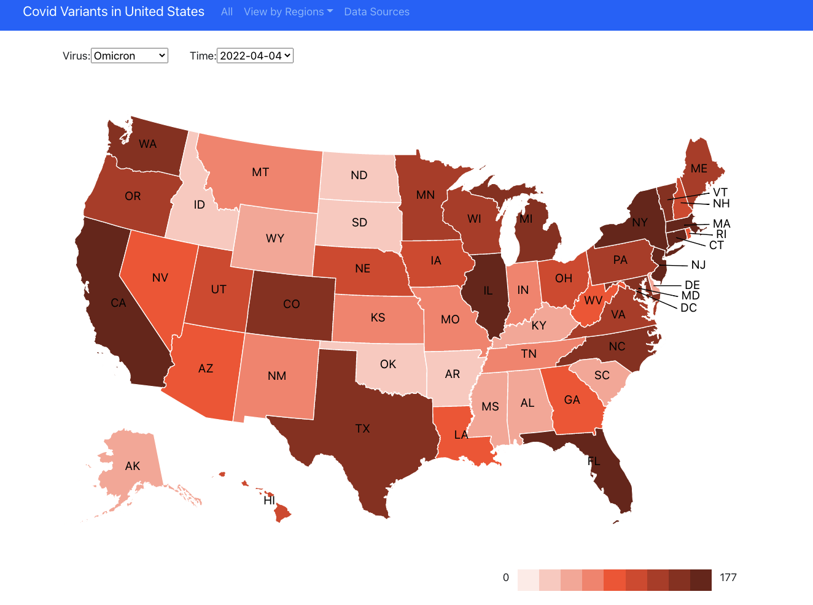

# CoVariants Project
- Display kinds of variants Covid-19 data
- Online version: https://baskvava.github.io/CoVariant-FE-2022/

### Author
[baskvava](https://github.com/baskvava), [QuenLuo](https://github.com/QuenLo), Yuxi Liang, Serena Chen, Zewen Xu, Jiacheng Sun, Mengying Xie

**- 2021 Fall COMP/ELEC 425/554 004, Ray Simar** 
1.10 - How might we display variants?

**- 2022 Spring COMP 590 Computer Systems Architecture, Ray Simar** 
sp22-variant-display

### Credit
Emma B. Hodcroft. 2021. "CoVariants: SARS-CoV-2 Mutations and Variants of Interest." https://covariants.org/
